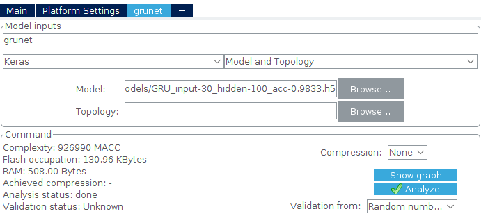
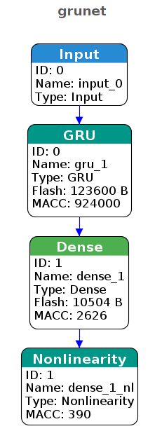
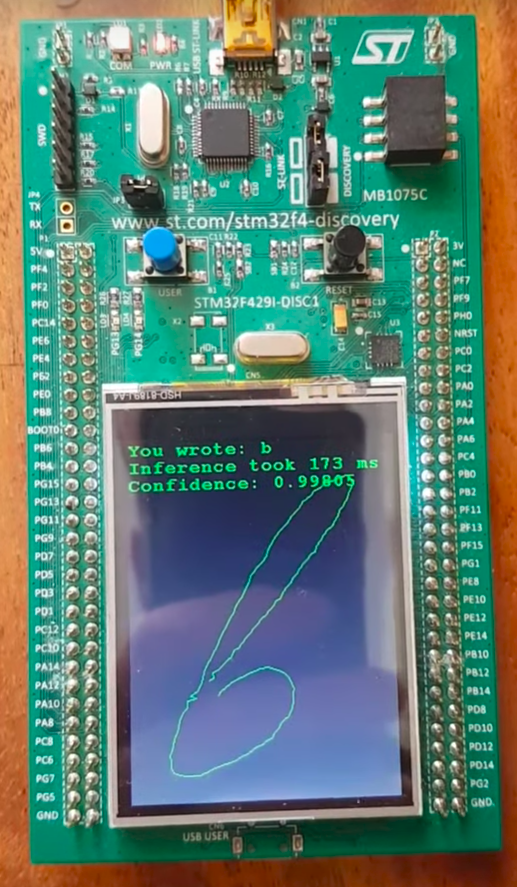

# STM32F429 Online handwritten character recognition

This project demonstrates Neural Networks inference in MCUs with constrained resources (memory and CPU frequency).

### Binaries

See [Releases](https://github.com/dizcza/stm32f429-chars/releases). To upload an ELF file, use STM32 CubeProgrammer.


### Task

Online handwritten character classification.


### Dataset

[UJIpenchars2](http://archive.ics.uci.edu/ml/datasets/UJI+Pen+Characters+(Version+2))


### Model

Gated Recurrent Unit.

- input shape: `(30, 2)` - 30 points of X and Y from a touch screen;
- GRU hidden unit shape: `(100,)`;
- output shape: `(26,)` - 26 English letters.

```python
from keras import layers, models

gru = models.Sequential()
gru.add(layers.GRU(units=100, activation='tanh', recurrent_activation='hard_sigmoid',
                   return_sequences=False, implementation=1,
                   input_shape=(30, 2)))
gru.add(layers.Dense(units=26, activation='softmax'))
```

Model training script: [gru.py](https://github.com/dizcza/ujipen/blob/master/gru.py)

Pretrained model dir: [models](models)


### X-CUBE-AI

[X-CUBE-AI](https://www.st.com/en/embedded-software/x-cube-ai.html)

Usage: [GRU inference](Modules/Recognition/gru_infer.h)






### Hardware

STM32F429 Discovery board.

- Flash: 2048 Kb
- RAM: 256 Kb
- CPU: 180 MHz


### YouTube demo

[](https://www.youtube.com/watch?v=8qtlnYSxpFk)

